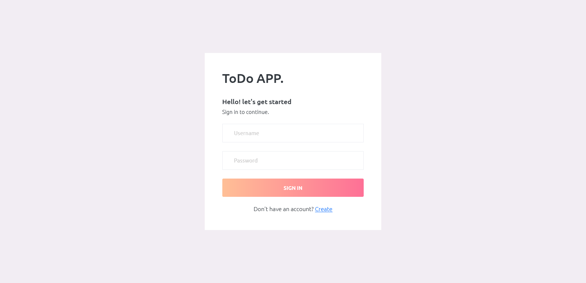
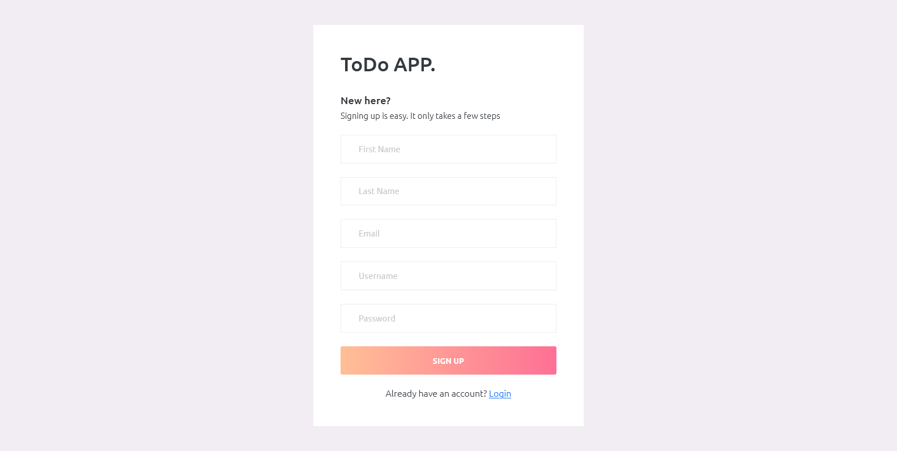
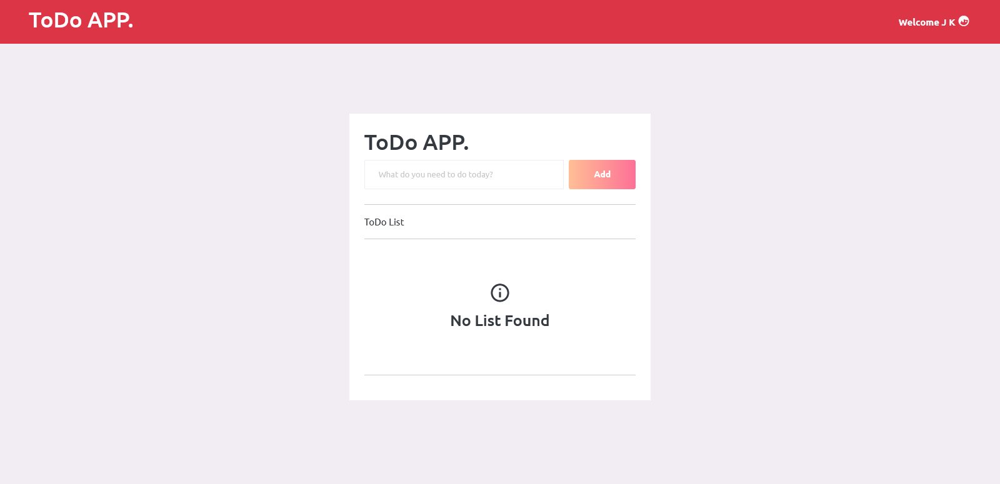

# ToDo Application using python django

Install Step
------------

1. python -m venv env
2. env\Scripts\activate
3. cd [project_file]
4. python manage.py migrate
5. python manage.py runserver

-----------

